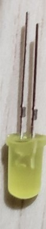
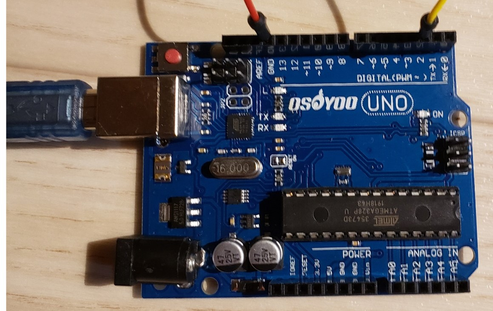

# Arduinoの使い方について
Arduinoの使い方について記載します。
## Arduinoとブレッドボード
### 1.この作業の使用物品

ブレッドボード

")
配線(2本)


LED（1個）


抵抗（1kΩ1本）

### 2.出力について

pin番号の部分から電気出力し、GNDへ返っていきます。

### 3.部品知識

同じレーンの連結部分(縦5列の部分等)は内部でつながっています。


抵抗は今回1KΩを使います。使わないとLEDがダメージかなり食らいます。(破損します。)



LEDは長い方が＋で短い方が－。－がGND側になるように使用します。

### 4.コーディング

エディタを起動し、下記コードエディタにを記載します。
```
void setUp() {
  pinMode(2,OUTPUT); // デジタルpin2に出力
}

void loop() {
  digitalWrite(2,HIGH); // デジタルpin2に出力ON
  delay(1000); // 1秒待つ
  digitalWrite(2,LOW); // デジタルpin2に出力OFF
  delay(1000); // 1秒待つ
}
```
左上にボタンがあります。  
そこの左のボタンがコンパイル、右のボタンがアップロード（書き込み）です。アップロードは組み立て作業後にやるので今は実行しません。  
下側にあるのがコンソールです。

### 5.組み立て

コーディング内容通り、2pinより出力し、GNDで受け取るように接続します。


右側端子から出力→抵抗で威力を弱める→LEDで電気を受け取る→左側の端子で電気を受け取る の流れで回線を組みます。

### 6.結果確認

コーディング内容通り1秒ごとに点灯動作を繰り返していれば成功です。

