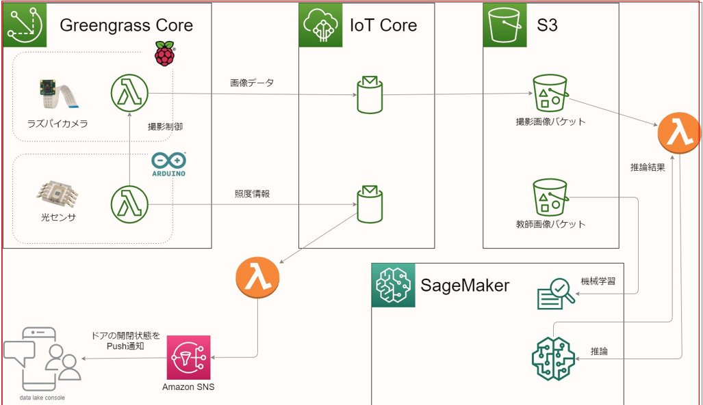

# SMART COOLER
小型冷蔵庫にラズベリーパイとカメラを仕込み、冷蔵庫の中から何を取り出したかを判別するAP  
※こちら2020年2月ごろに作成されたものです。  
※凍結のため今後更新予定はありません。

## 下記ディレクトリ配下にも説明があります。
[Arduinoの使い方](Arduino/README.md)  
[RaspberryPiの使い方](RaspberryPi/README.md)

## 構成
- Arduino
- Raspberry Pi  Zero WH V1.1

## 使用AWSリソース
- greengrass
- S3

## スマートクーラーで使用するファイル群について
- src配下に配置しています。

## 構成図

※greengrass、IoT Core、S3以外の部分は実装前に構築が頓挫。

