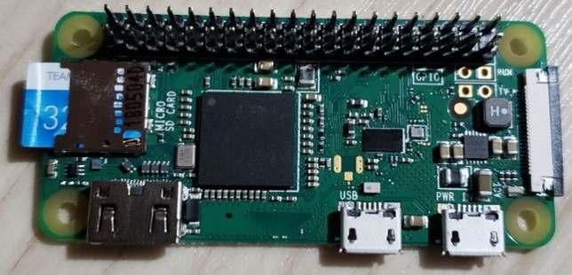
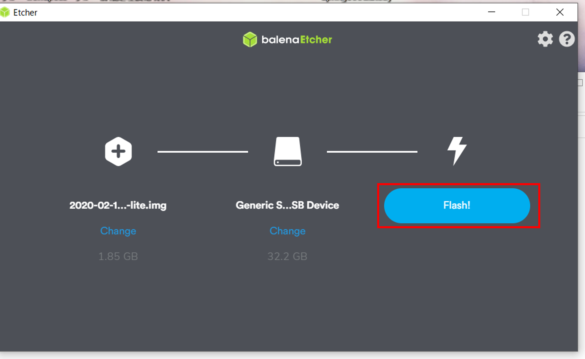

# Raspberry Piの初期設定
<span style="color: red; ">※こちら2020年2月ごろに作成されたものです。</span>
## 構成
- Raspberry Pi  Zero WH V1.1
- Raspbian(Lite)

## 手順

### 1.必要物品


Raspberry Pi本体です。  
今回はRaspberry Pi  Zero WH V1.1を使用します。


マイクロSDカード。  
16GBあれば大丈夫ですが、今回は32GBを使用します。
これにOSを入れたり、設定情報を書き込んで使用します。  
つまり差し替えるだけで別OSに変更可能です。


マイクロSD変換アダプターです。
PCとマイクロSD接続するために使用します。


マイクロUSBタイプBです。  
スマホの充電用に使用しているものです。  
電圧は5Vで電流は2.5Aあれば使えます。


ポケットwifiの画像ですが、ルーターでしたら問題ありません。
ローカルネットワークを組むことが目的です。

### 2.OS導入
[公式ページ](https://www.raspberrypi.org/downloads/raspbian/)へアクセスします。  
今回はAWS Greengrassでの使用を想定してます。  
コマンドラインでの使用を想定してます。


公式ページよりコマンドライン用のOSをダウンロードします(Raspbian Lite)。

### 3.マイクロSDカードへの書き込み
balenaEtcherを使うと楽です。
Zipファイルごと指定して書き込めます。

Flash!を押すだけでOKです。

### 4.無線設定

マイクロSD内にデータが書き込めていると思います。  
そこのboot直下に「ssh」ファイルと「wpa_supplicant.conf」ファイルを作成します。


「wpa_supplicant.conf」ファイルの中身です。

```
ctrl_interface=DIR=/var/run/wpa_supplicant GROUP=netdev
update_config=1
country=JP

network={
ssid="接続したいSSID"
psk="SSIDのパスワード"
}
```


画像の左側にあるマイクロSDカード接続端子にマイクロSDカードを接続します。  
電源にマイクロUSB タイプbの端子を接続します。  
電気が通れば自動起動します。

### 6.ネットワーク探し
ローカルネットワークを固定しなかった場合（動的に設定している場合）IPを探す必要があります。   
その場合「コマンドプロンプト」 で「arp -a」実行し接続ネットワークを調べます。  
そして「for /l %i in (0,1,255) do ping -w 1 -n 1 192.168.100.%i && arp -a 192.168.{ネットワークアドレス}.%i 」実行します。  
pingが通っているものを探すことで対象のネットワークを見つけます。  

### 7.ssh接続

「scp」を使用するので今回Tera Termを使用します。(他のツールでも使用できます。)  
ホスト部分にコマンド「ssh」の後に入力するIPを入力します。


ユーザ名PW入力します。  
初期ユーザ「pi」の初期PWは「raspberry 」となっております。


次のようにユーザ名でアクセスできていれば成功です。

### 8.Javaインストール
- javaをインストールしたい場合下記手順で実行できます。 
```
# インストールできるかチェックします。
apt-cache search oracle jdk  

# OKでしたらインストールします。 
sudo apt-get install oracle-java8-jdk

# NGでしたら下記コマンドを試します。(あればインストールします。)
sudo –s→apt update→apt search oracle-java8-jdk
# もしくは下記
apt search openjdk-8-jdk  

# インストール確認します。  
java -version 

# pathの確認をします。(pathが違ったら書き直して実行します。)。
which java
ls -l /usr/bin/java
ls -l /etc/alternatives/java
ls -l /usr/lib/jvm/java-8-openjdk-armhf/jre/bin/java

# 環境path設定
JAVA_HOME=/usr/lib/jvm/java-8-openjdk-armhf
```

### 9.標準設定の変更
必要時行ってください。
```
# 変更する場合。
sudo raspi-config
```
Localization OptionsのChange Localeを日本語に変更できます。  
Change Timezoneで日本時間にします。  
言語のオンオフはスペースキーで行います。
GUIが必要なければBoot OptionのDesktop/CLIを変更します。  
必要に応じてその他の設定も見直しましょう。

```
設定終了後は再起動して反映させます。
sudo reboot
```

```
# 日本語フォントインストール
sudo apt-get install fonts-ipaexfont
# vimインストール
sudo apt-get install vim
```


